<div align="center">

<a href="https://github.com/uppifyagency/Shopify-Development-Skill-for-AI-Agents">
  
</a>

# Shopify Development Skill for AI Agents

### Give Claude Code, Amp & Cursor the *entire* shopify.dev reference — so they look up Liquid, themes, apps, Hydrogen & Functions instead of hallucinating them.

A drop-in **agent skill** that turns the official Shopify developer docs into a navigable, 1:1 verbatim knowledge base your AI codes against.

<br>

[](LICENSE)
[](https://www.anthropic.com/claude-code)
[](https://ampcode.com)
[](https://cursor.com)
[](https://shopify.dev)
[](https://github.com/uppifyagency/Shopify-Development-Skill-for-AI-Agents/stargazers)

**[Install](#-install) · [What's inside](#-whats-inside) · [How it works](#-how-it-works) · [Example](#-example) · [FAQ](#-faq)**

</div>

---

## 🧠 The problem this solves

Ask any AI coding agent to write a Shopify theme section, a Liquid filter chain, or a Shopify Function and you hit the same wall: **it invents Liquid filters that don't exist, guesses schema attributes, and mixes up Storefront vs Admin APIs.** Shopify's surface is huge — Online Store themes, Liquid, custom apps, Hydrogen, Functions, metafields — and most of it post-dates the model's training cutoff.

This skill closes that gap. Instead of relying on memory, your agent reads the **exact, verbatim Shopify documentation** — captured 1:1 from [shopify.dev](https://shopify.dev) and reorganized for instant lookup.

```diff
- "Use the | money_format filter…"        ✗ hallucinated, doesn't exist
+ "Per indexes/liquid-filters.md → the    ✓ verbatim, traceable
+  filter is | money, defined in ref/10"
```

## ✨ What you get

- **648 pages, 18 chapters, 1:1 verbatim** — parameter tables, schemas and code examples kept exactly as Shopify wrote them. No summaries, no paraphrasing, nothing invented.
- **Indexed for zero-context lookup** — symbol indexes for **135 Liquid objects · 148 filters · 28 tags** + a task router. The agent greps the right heading and reads only that slice, never the whole file.
- **Full-surface coverage** — themes & Liquid, theme JS APIs, custom apps & extensions, headless/Hydrogen, Shopify Functions, custom data, and AI/agentic commerce.
- **Traceable** — every reference page links back to its official `shopify.dev` source.
- **Drop-in** — one folder, copy it into your agent's skills directory, done. Works with Claude Code, Amp, Cursor and any agent that loads Markdown skills.

## 📦 What's inside

| Area | Coverage |
|------|----------|
| **Themes & Architecture** | Layouts, JSON templates, sections, blocks, snippets, settings, config, locales — full schemas |
| **Liquid Reference** | **135 objects · 28 tags · 148 filters** — signatures, parameters, examples |
| **Theme APIs** | Ajax cart API + Section Rendering API |
| **Best Practices & Tooling** | Performance, accessibility, Shopify CLI, Theme Check, GitHub workflow, Theme Store |
| **Custom Apps & Extensions** | OAuth & session tokens, App Bridge, webhooks, billing, Admin / Checkout / Customer-account / POS extensions |
| **Headless & Hydrogen** | Storefront API usage, Hydrogen, Oxygen, Customer Account API |
| **Shopify Functions** | Discounts, validation, cart transform, delivery & payment customization |
| **Custom Data & AI** | Metafields, metaobjects, agentic commerce (UCP / MCP, llms.txt / agents.md) |

> Source: `shopify.dev`, captured **2026-06-08**. See the [chapter map](shopify-development/SKILL.md#reference-chapter-map) for the full breakdown.

## ⚡ Install

### Claude Code

```bash
git clone https://github.com/uppifyagency/Shopify-Development-Skill-for-AI-Agents.git
cp -r Shopify-Development-Skill-for-AI-Agents/shopify-development ~/.claude/skills/
```

For a single project instead of globally, copy into `<your-project>/.claude/skills/`.

### Amp

```bash
cp -r Shopify-Development-Skill-for-AI-Agents/shopify-development ~/.config/agents/skills/
```

Project-local: copy into `.agents/skills/`.

### Cursor & other agents

Clone the repo into your project and point your agent at the skill — e.g. add a [Cursor Rule](https://docs.cursor.com/context/rules) that references `shopify-development/SKILL.md`, or `@`-mention the folder. Any agent that can read Markdown can use it.

**Then just ask** — *"build me a Shopify product section with an image picker and color scheme"* — and the agent auto-loads the skill on any Shopify task.

## 🔍 How it works

```text
shopify-development/
├── SKILL.md          # router: orientation + task-routing + lookup protocol
├── cheatsheet.md     # one-page quick reference (file tree, Liquid, CLI, Ajax)
├── indexes/          # liquid-objects · liquid-filters · liquid-tags · schemas · task-routing
└── reference/        # 18 chapters, verbatim 1:1
```

1. **Install** the folder into your agent's skills directory.
2. The agent **auto-loads** `SKILL.md` the moment a task touches Shopify.
3. It **routes** — identifies the surface (theme? Liquid? app? Hydrogen? Function?), looks the symbol up in an index to get the exact file + heading, then **reads only that slice**.

The result: answers grounded in the real docs, **traceable to source, never guessed** — and a small context footprint, because the agent never loads a whole reference file.

## 💡 Example

> **You:** "Add a savings badge to my product card that only shows when the variant is on sale."

Without the skill, the agent guesses filter names and `compare_at_price` access patterns. With it, the agent:

1. Routes to **Liquid in a section** → `indexes/liquid-objects.md` for `variant` / `product`.
2. Confirms `variant.compare_at_price` and the `| money` filter against `reference/07` and `reference/10` — **verbatim**.
3. Writes correct Liquid the first time, with the schema setting wired in.

```liquid

  
  <span class="badge">Save {{ saved | money }}</span>

```

## ❓ FAQ

<details>
<summary><strong>Does Claude Code / Cursor actually know Shopify Liquid?</strong></summary>

Partially, and unreliably — Liquid filters, schema attributes and the theme/app/Hydrogen split change faster than model training cutoffs. This skill gives the agent the **verbatim docs** to read instead of recalling, which is what stops the made-up `| money_format`-style filters.
</details>

<details>
<summary><strong>How is this different from the Shopify Dev MCP server?</strong></summary>

They're complementary. The **MCP server** queries the live, auto-generated **GraphQL/REST schemas** (Admin, Storefront, Customer Account). This **skill** covers the conceptual + how-to + reference docs (Liquid, theme architecture, schemas, API *usage*, Functions, extensions) 1:1 — the parts MCP doesn't serve. Use both: skill for "how do I build this", MCP for "what's the exact GraphQL field". Every schema this skill deliberately omits is listed, with its URL, inside the relevant chapter.
</details>

<details>
<summary><strong>Which agents are supported?</strong></summary>

Anything that loads a Markdown "skill" folder: **Claude Code** (`~/.claude/skills/`), **Amp** (`~/.config/agents/skills/`), and **Cursor** or others via rules / file references. It's plain Markdown — no runtime, no dependencies.
</details>

<details>
<summary><strong>Does it work offline?</strong></summary>

Yes. Once cloned, it's static Markdown on disk. No API calls, no network needed.
</details>

<details>
<summary><strong>Is the content current?</strong></summary>

Captured from `shopify.dev` on **2026-06-08**. The fast-moving AI/agentic chapter flags what was unverified at capture time. Re-pull the repo to get updates.
</details>

<details>
<summary><strong>Is this affiliated with Shopify?</strong></summary>

No. Uppify is an independent project, not affiliated with or endorsed by Shopify. The reference content is derived from Shopify's public developer documentation and remains © Shopify Inc.
</details>

## 🧭 Scope & limits

Covers the conceptual + how-to + reference (Liquid / schema / API-usage) docs 1:1. It intentionally does **not** dump the giant auto-generated GraphQL/REST schemas (Admin, Storefront, Customer Account), per-component Hydrogen/Polaris/Checkout-UI reference, or the full webhook-topic enum — those change often and are best queried live via the [Shopify Dev MCP server](https://www.npmjs.com/package/@shopify/dev-mcp). Every omitted reference is listed (with its URL) inside the relevant chapter's `## Pagine aggiuntive` section.

## 🤝 Contributing & support

Found a stale page or a gap? [Open an issue](https://github.com/uppifyagency/Shopify-Development-Skill-for-AI-Agents/issues) or a PR.

If this saves your agent from one hallucinated Liquid filter, **[give it a ⭐](https://github.com/uppifyagency/Shopify-Development-Skill-for-AI-Agents/stargazers)** — it helps other Shopify developers find it.

Questions or work with us → **email.vlad.vrinceanu@gmail.com**

## 📄 License & attribution

The skill structure, indexes and navigation are released under the [MIT License](LICENSE). The documentation content under `shopify-development/reference/` is derived from Shopify's developer documentation ([shopify.dev](https://shopify.dev)) and remains © Shopify Inc.; every page links to its official source. See [NOTICE](NOTICE). Uppify is an independent project and is **not affiliated with or endorsed by Shopify**.

---

<div align="center">

**Built by [Uppify](https://github.com/uppifyagency)** · An AI knowledge skill for Shopify development

<sub>Shopify theme development · Liquid template language · Shopify app development · Hydrogen headless commerce · Shopify Functions · metafields & metaobjects · Shopify CLI · Online Store 2.0 · Claude Code skill · Amp skill · Cursor · AI coding agents</sub>

</div>
